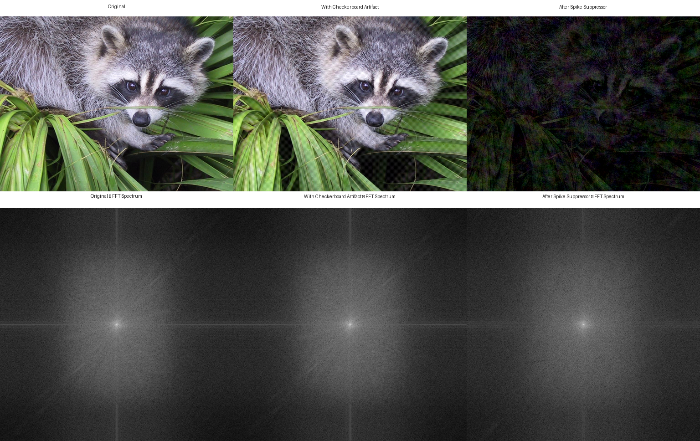
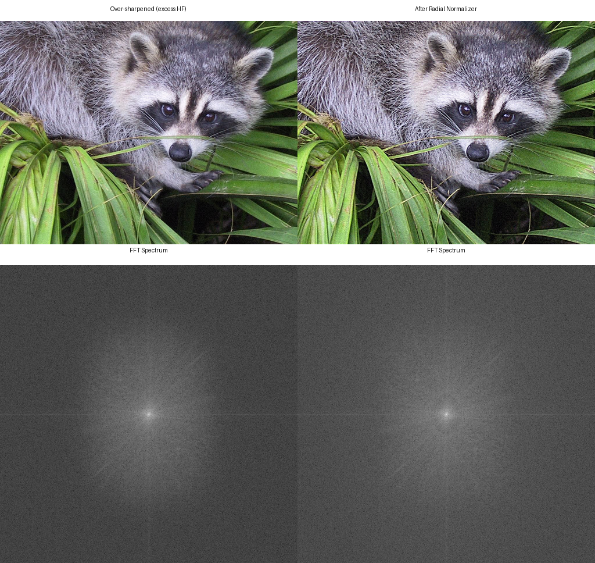
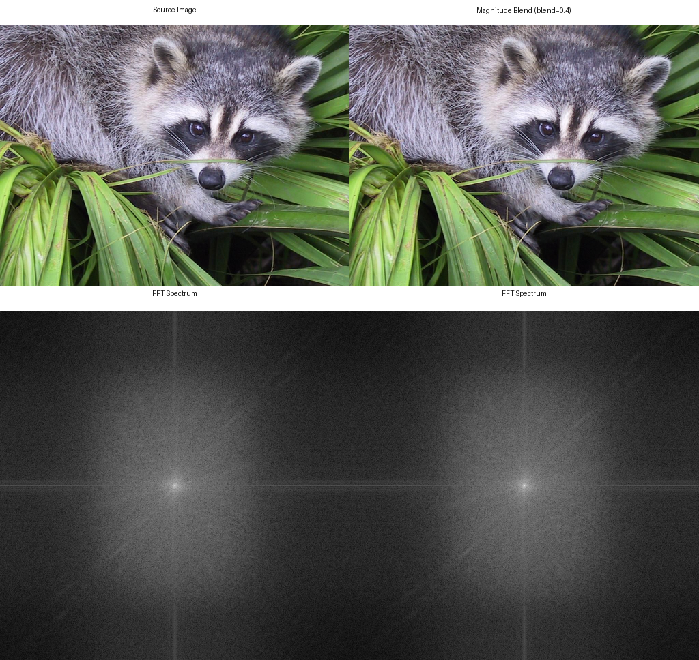

# ComfyUI Spectral Preprocessing Nodes

FFT-based image preprocessing nodes for ComfyUI, designed to reduce latent instability in **Flux image-to-image** workflows.

These nodes operate entirely in the frequency domain. Their goal is **not** perceptual image quality — it is to suppress synthetic frequency artifacts that are nearly invisible to humans but destabilise the VAE encoder and diffusion model, causing:

- Sparkle / salt-and-pepper noise in output
- Coloured artifacts and chromatic fringing
- Grainy or noisy silhouettes
- Broken textures
- Failure to reconstruct coherent structure

---

## The Problem

A fixed set of img2img parameters can work perfectly for some source images while completely failing on others. The culprit is often **frequency-domain contamination** — periodic artifacts introduced by JPEG compression, AI upscaling, checkerboard patterns from transposed convolutions, or the generative model itself. These artifacts appear as isolated spikes or structured bands in the FFT magnitude spectrum.

<p align="center">
  
</p>

*Left: original image. Centre: image with injected checkerboard artifact (visible as a cross-shaped spike pattern in the FFT spectrum). Right: after **Spectral Spike Suppressor** — the spike is removed from the spectrum, the spatial image looks virtually identical.*

---

## Installation

1. Clone this repository into your ComfyUI `custom_nodes` folder:

```bash
cd ComfyUI/custom_nodes
git clone https://github.com/EdoardoGuerriero/ComfyUI-Spectral-Preprocessing-Nodes.git
```

2. Restart ComfyUI.

**Dependencies:** `numpy`, `scipy` — both are included with a standard ComfyUI installation.

---

## Nodes

All nodes appear under **Spectral Preprocessing** in the node browser.

---

### Spectral Spike Suppressor

Detects and attenuates isolated peaks in the FFT magnitude spectrum. Targets periodic artifacts that produce narrow spikes in frequency space: JPEG ringing, checkerboard patterns from transposed convolutions, Moiré fringes, CNN grid artifacts.

**How it works:** FFT → median-filter background → MAD-based z-score map → smooth sigmoid attenuation mask → reconstruct using original phase → IFFT. Phase is never modified, so edges are preserved exactly.

| Parameter | Default | Description |
|---|---|---|
| `threshold_sigma` | 3.0 | Z-score above which a coefficient is treated as a spike. Lower = more aggressive. |
| `attenuation` | 0.85 | Maximum fraction of spike energy removed. 1.0 = full suppression. |
| `kernel_size` | 15 | Median filter size for background estimation. Larger = more context. |
| `preserve_dc` | True | Protect the DC coefficient (mean brightness). Recommended: on. |
| `tile_size` | 0 | Tile size for large images. 0 = whole image at once. |
| `tile_overlap` | 64 | Overlap between tiles in pixels. |

---

### Radial Spectrum Normalizer

Natural photographs follow a power law: `Power(f) ∝ 1/f^α` with α ≈ 2. AI-generated images often carry excess high-frequency energy. This node estimates the current radial power spectrum, builds a smooth correction gain curve toward the target law, and blends it in.

<p align="center">
  
</p>

*Left: source with injected high-frequency noise (excess HF visible as a bright haze at the edges of the FFT spectrum). Right: after **Radial Spectrum Normalizer** — HF energy reduced, spectrum closer to the natural 1/f² slope.*

| Parameter | Default | Description |
|---|---|---|
| `alpha` | 2.0 | Exponent of target 1/f^alpha power law. Natural photos ≈ 2.0. |
| `strength` | 0.5 | Blend factor. 0 = no change, 1 = full correction. Start low. |
| `preserve_low_freq` | 0.1 | Normalised radius below which gain is frozen at 1.0. |
| `smoothing` | 0.05 | Gaussian smoothing of the radial gain curve. Higher = fewer ringing artifacts. |
| `tile_size` | 0 | Tile size for large images. |
| `tile_overlap` | 64 | Tile overlap in pixels. |

---

### Adaptive HF Compressor

Applies soft-knee dynamics compression (like an audio compressor) to the high-frequency band of the FFT magnitude. If the HF energy is below the threshold, nothing changes. Only excess energy above the threshold is reduced, following a configurable ratio and soft knee. The internal shape of the HF spectrum is preserved — only the overall level changes.

| Parameter | Default | Description |
|---|---|---|
| `threshold` | 0.15 | RMS magnitude threshold. HF energy below this is untouched. |
| `ratio` | 4.0 | Compression ratio. 4:1 = four units of excess become one unit. |
| `knee` | 0.05 | Soft-knee width. 0 = hard knee. Larger = smoother transition. |
| `strength` | 0.75 | Blend between original (0) and fully compressed (1). |
| `hf_cutoff` | 0.25 | Normalised radius above which signal is considered high-frequency. |
| `tile_size` | 0 | Tile size for large images. |
| `tile_overlap` | 64 | Tile overlap in pixels. |

---

### Directional Artifact Suppressor

Detects and attenuates frequency-domain energy that is anomalously concentrated along specific angular directions. Targets: checkerboards, ESRGAN stripe artifacts, CNN periodic patterns, aliasing bands, any periodic texture with a dominant orientation.

**How it works:** Bins the FFT magnitude into angular sectors (0–180°). Estimates the smooth angular energy background via a circular median filter. Computes a per-angle z-score, builds a smooth sigmoid attenuation, maps it back to the 2-D Cartesian frequency grid.

| Parameter | Default | Description |
|---|---|---|
| `threshold_sigma` | 3.0 | Z-score threshold for flagging a direction as anomalous. |
| `attenuation` | 0.8 | Maximum fraction of energy removed in flagged directions. |
| `angular_kernel` | 5 | Half-width (bins) of the circular median filter. |
| `min_radius` | 0.05 | Minimum radius included in analysis. Pixels closer to DC are left alone. |
| `n_angle_bins` | 180 | Angular resolution (bins over 0–180°). More bins = finer discrimination. |
| `tile_size` | 0 | Tile size for large images. |
| `tile_overlap` | 64 | Tile overlap in pixels. |

---

### Log Spectrum Peak Compressor

Processes the FFT magnitude in the **logarithmic domain**, inspired by cepstral and homomorphic signal processing. Working in log space turns multiplicative spectral distortions (gain patterns, grid artifacts, repetitive texture overlays) into additive signals that are much easier to separate and compress.

**Algorithm:** FFT → log(magnitude) → smooth background → compress residual peaks → exp → IFFT. The phase is never touched.

| Parameter | Default | Description |
|---|---|---|
| `peak_threshold` | 1.0 | Log-domain residual threshold. Smaller = more aggressive. |
| `ratio` | 4.0 | Compression ratio applied to log-domain peaks above the threshold. |
| `smoothing` | 0.05 | Background blur strength as fraction of image size. |
| `strength` | 0.8 | Blend between original (0) and fully compressed (1). |
| `background_mode` | gaussian | `gaussian` = smoother envelope; `uniform` = faster. |
| `tile_size` | 0 | Tile size for large images. |
| `tile_overlap` | 64 | Tile overlap in pixels. |

---

### Noise Floor Lifter

Estimates the uniform spectral noise floor (the background energy level in the FFT magnitude) and subtracts it. Analogous to **spectral subtraction** in audio processing. Particularly effective on AI-generated images and heavily compressed sources where the noise floor is elevated relative to natural photographs.

Because the subtraction is global and uniform, it introduces zero spatial ringing.

| Parameter | Default | Description |
|---|---|---|
| `floor_percentile` | 10.0 | Percentile of magnitude distribution used as the noise floor estimate. |
| `strength` | 0.7 | Fraction of the noise floor to subtract. |
| `over_subtraction` | 1.0 | Multiplier on floor estimate. Values > 1 are more aggressive. |
| `preserve_dc` | True | Leave the DC coefficient (mean brightness) untouched. |
| `tile_size` | 0 | Tile size for large images. |
| `tile_overlap` | 64 | Tile overlap in pixels. |

---

### Spectral Channel Equalizer

Reduces inter-channel spectral mismatch to suppress colour fringing artifacts. Computes the radial power spectrum per channel, takes the mean across R/G/B as a reference, and applies a smooth radial gain per channel to equalise them. Global colour balance is protected by `preserve_low_freq`.

Targets: colour fringing, chromatic halos, colour noise — common in AI-upscaled and AI-generated images.

| Parameter | Default | Description |
|---|---|---|
| `strength` | 0.5 | How strongly to equalise channel spectra. 0 = no change, 1 = full equalization. |
| `preserve_low_freq` | 0.08 | Normalised radius below which channel gains are frozen at 1.0. |
| `smoothing` | 0.06 | Smoothing sigma for radial gain curves. |
| `tile_size` | 0 | Tile size for large images. |
| `tile_overlap` | 64 | Tile overlap in pixels. |

---

### Spectral Magnitude Blend

Blends the FFT magnitudes of two images while preserving the **phase** (spatial structure) of image A.

The magnitude encodes *what kind of texture*; the phase encodes *where things are*. Keeping phase_A and blending magnitudes produces an image that retains the spatial layout of A but gradually adopts the spectral character of B.

**Typical use:** feed a known-clean natural photograph as `image_b` and an AI-generated image as `image_a`. At blend=0.3–0.5 the output has A's content but B's spectral texture, making the AI image feel more natural to the VAE.

<p align="center">
  
</p>

| Parameter | Default | Description |
|---|---|---|
| `blend` | 0.3 | 0 = keep A's magnitude entirely, 1 = use B's magnitude entirely. |
| `frequency_band` | all | Restrict blending to `all`, `low`, `mid`, or `high` frequency band. |

---

### Spectral Phase Blend

Blends the FFT **phases** of two images while retaining the magnitude of image A. Phase encodes spatial structure — blending phases morphs the spatial geometry of the image while its spectral character is preserved.

Uses circular interpolation (`angle(lerp(exp(iφ_a), exp(iφ_b), t))`) to correctly handle the ±π phase wrap.

⚠ Even small blend values (0.05–0.1) produce visible structural changes. Start low.

| Parameter | Default | Description |
|---|---|---|
| `blend` | 0.05 | 0 = keep A's phase, 1 = use B's phase. Start at 0.05. |
| `frequency_band` | all | Restrict blending to `all`, `low`, `mid`, or `high` frequency band. |

---

### FFT Spectrum Visualizer *(debug)*

Renders a 6-panel diagnostic grid of the FFT spectrum. Connect the output to a **PreviewImage** node.

| Panel | Description |
|---|---|
| Log Magnitude | `log(1 + \|FFT\|)` normalised. Bright spots = concentrated energy. |
| Phase | Phase angle mapped to [0,1]. Uniform = natural image. |
| Radial Profile | Mean magnitude vs radius (white), with 1/f² reference (grey). |
| Angular Profile | Energy vs angle. Spikes = directional artifacts. |
| Spike Heatmap | Z-score map from the same detection step as Spike Suppressor. |
| Gain Mask | The gain that Spike Suppressor would apply at these parameters. |

| Parameter | Default | Description |
|---|---|---|
| `channel` | avg | Which channel to analyse: `avg`, `R`, `G`, `B`. |
| `kernel_size` | 15 | Match to Spike Suppressor for direct comparison. |
| `threshold_sigma` | 3.0 | Match to Spike Suppressor. |
| `attenuation` | 0.85 | Shown in the gain mask panel. |
| `panel_size` | 256 | Pixel size of each individual panel. |

---

## Workflows

Three example workflows are included in the [`workflows/`](workflows/) folder.

### 1. Single-node showcase (`01_single_node_showcase.json`)

Load image → Spectral Spike Suppressor → side-by-side FFT spectra (before/after) + output preview.

### 2. Full pipeline (`02_full_pipeline.json`)

Chains all five artifact suppression nodes in sequence, with a spectrum comparison at the start and end.

### 3. Per-node comparison (`03_per_node_comparison.json`)

Runs each node independently from the same source image, with a spectrum visualizer after each one. Useful for understanding what each node contributes.

---

## Design Philosophy

- **Preserve visual appearance.** These nodes never apply a low-pass filter or blur. All modifications are in the frequency domain and are designed to be perceptually invisible.
- **Preserve phase exactly.** All artifact-suppression nodes modify only the FFT magnitude. The phase — which encodes spatial structure and edges — is never changed.
- **Smooth, never hard.** All gain masks use soft sigmoid transitions, never binary thresholds. This prevents Gibbs phenomenon (ringing) at mask edges.
- **No ringing.** The directional and radial gains are always Gaussian-smoothed before application.
- **Modular and stackable.** Each node is independent. You can use any subset, in any order.

---

## Tiled Processing

All artifact-suppression nodes support tiled processing for large images (2048 px and above). Set `tile_size` to 512–1024 and `tile_overlap` to 64–128. Tiles are blended using a 2-D Hann window (overlap-add), so tile boundaries are invisible.

When `tile_size = 0` (default), the whole image is processed in one FFT — recommended for most use cases.

---

## Recommended Stacking Order

For a standard Flux img2img preprocessing chain:

```
LoadImage
  ↓
SpectralSpikeSuppressor       ← remove periodic artifacts first
  ↓
DirectionalArtifactSuppressor ← then directional bands
  ↓
NoiseFloorLifter              ← clean the noise floor
  ↓
SpectralChannelEqualizer      ← fix colour fringing
  ↓
RadialSpectrumNormalizer      ← nudge toward natural spectral shape
  ↓
[optional] AdaptiveHFCompressor or LogSpectrumPeakCompressor
  ↓
VAE Encode → Flux KSampler
```

Use the **FFT Spectrum Visualizer** before and after the chain to verify the changes are meaningful for your specific source image.

---

## Parameter Tuning Guide

| Artifact | Start with | Key parameters |
|---|---|---|
| Checkerboard / grid | Spike Suppressor + Directional | `threshold_sigma` ↓ if weak effect |
| JPEG ringing | Spike Suppressor | `kernel_size` ↑ for broader spikes |
| AI upscaling noise | Noise Floor Lifter | `floor_percentile` 5–15 |
| Colour fringing | Channel Equalizer | `strength` 0.3–0.7 |
| "Too synthetic" texture | Radial Normalizer | `alpha` 2.0, `strength` 0.3–0.6 |
| Over-sharpened | HF Compressor | `threshold` ↓, `ratio` 2–4 |
| Mixed / unknown | Full pipeline | all defaults, then tune individually |

---

## Future Directions

- **Latent Spectral Manipulator** — apply FFT blending directly in Flux's latent space (16-channel VAE latents) before sampling, bypassing the pixel domain entirely.
- **Spectral Sampling Guidance** — per-step frequency-domain correction during denoising, analogous to classifier guidance but using spectral distance to a reference image.

---

## Technical Notes

- All processing uses **NumPy** with vectorised operations. No Python loops over pixels.
- The FFT is applied per-channel (R, G, B independently) using `numpy.fft.fft2`.
- The DC component (mean brightness) is protected by all suppression nodes.
- Output size is guaranteed to exactly match input size via a center-crop guard at every node output.
- Requires: `numpy`, `scipy`. No additional dependencies.

---

## License

MIT
